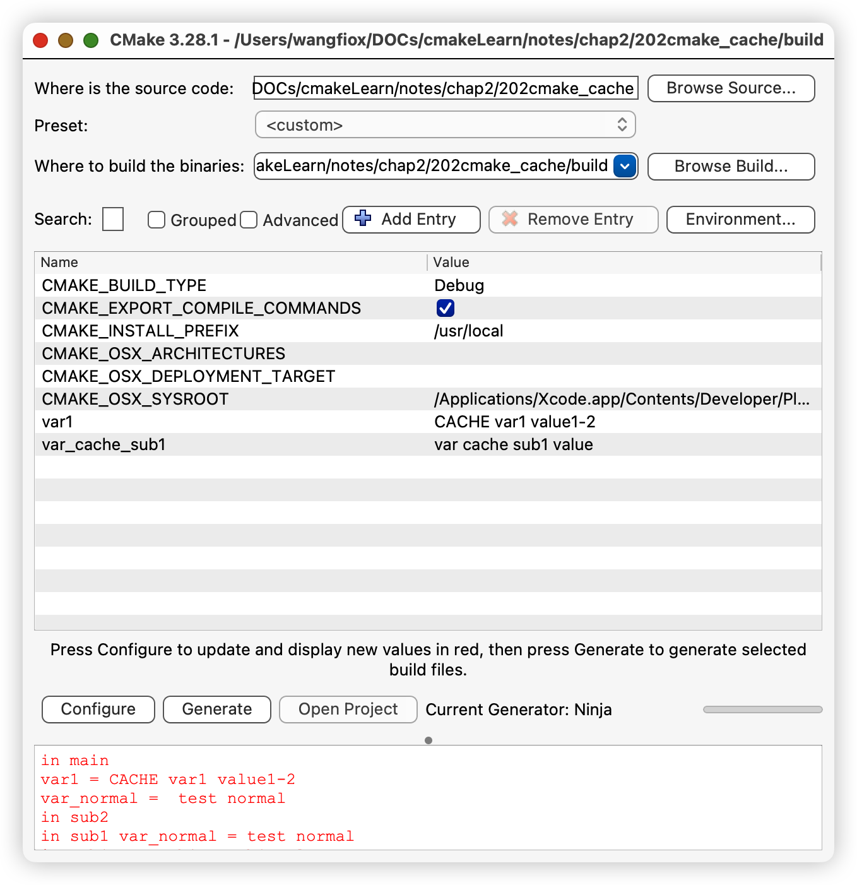

# chap3 - cmake 主要语法

## if 控制流程

### 语法格式

```cmake
if (<condition>)
    <commands>
elseif (<condition>)
    <command>
else()
    <command>
endif()
```

### 基本表达式

cmake if 基本表达式，也就是`<condition>`可以有什么

1. `<constant>`常量

ON, YES, TRUE, Y 或者 非零数（包括浮点数） --> TRUE

0, OFF, NO, FALSE, N, IGNORE, NOTFOUND, 空字符串，或者以 NOTFOUND 结尾 --> FALSE

2. `<variable>`变量

非 FALSE 且 已被定义 --> TRUE

1)FLASE 或者 2)未定义 变量、环境变量 --> FALSE

宏参数 不是变量（宏只是替换）

3. `<string>`字符串

字符串的值是常量 TRUE --> TRUE

其他带引号的字符始终计算为 FALSE（不认识）

### 逻辑运算符

1. `NOT`

2. `AND`

3. `OR`

4. 复合：(condition1) AND (condition2 OR condition3)

### if 判断语句

#### 一元判断

1. EXISTS 用来检查一个 文件 或 目录 是否存在

2. COMMAND 检查一个 命令 或者 函数 是否存在

3. DEFINED 判断变量是否被定义

#### 二元判断

1. （变量） QEUAL LESS LESS_EQUAL GREATER GREATER

可以跨类型进行判断

```cmake
# 数字判断
set(VAR1 123)
if(VAR1 EQUAL "123")
    message("VAR1 equal 123")
endif()
```

2. （字符串） STREQUAL STRLESS STRLESS_EQUAL STRGREATER STRGREATER_EQUAL

3. （版本号的判断）VERSION_EQUAL VERSION_LESS VERSION_LESS_EQUAL VERSION_GREATER VERSION_GREATER_EQUAL

4. MATCHES，这个支持正则表达式

比方说，我们可能会开放用户输入之类的，
我们可以通过正则表达式，看看用户的输入是否正确

```cmake
# 匹配上了
if("abcd123" MATCHES "[a-z]+")
    message("is match")
endif()
```

```cmake
# 没有匹配上
if("abcd123" MATCHES "^[a-z]+$")
    message("is match")
else()
    message("is not match")
endif()
```

#### 存在性检查

#### 文件操作

#### 比较

#### 版本比较

### 遗留问题

1. 判断语句过长
2. 无法嵌入其他的函数中

## 变量 与 缓存

1. 缓存下来，写入 cmake 生成的一系列文件中。再次生成的时候，不会重复生成
2. 全局性质，多个文件可以共享

cache 覆盖策略设置

缓存变量对应 cmake-gui 和 ccmake

cmake 内置缓存变量，比方说之前用到的 BUILD_SHARED_LIBS

-D 传递缓存变量

### 缓存变量的基础语法 和 使用

```cmake
set(<variable> <value> CACHE <type> <docstring> [FORCE])
```

- 缓存变量，需要加`CACHE`
- type 表示 缓存变量的类型
  - BOOL ON/OFF 选择框
  - FILEPATH 文件选择
  - PATH 目录选择
  - STRING
  - INTERNAL
- docstring 说明
- FORCE 强制修改

强制修改的意思就是，如果我们第一次设置成了 001，第二次设置成了 002，
如果我们不加 FORCE，那么就不会覆盖

缓存变量，只要生成了 build 文件，甚至是把变量的定义给删除了，
依然可以访问变量。

```cmake
cmake_minimum_required(VERSION 3.20)
project(cmake_cache)

# 设置缓存变量的类型，对应于string类型
set(var1 "CACHE var1 value" CACHE STRING "cache doc")

set(var1 "CACHE var1 value1-1" CACHE STRING "cache doc")
set(var1 "CACHE var1 value1-2" CACHE STRING "cache doc")

message("var1 = ${var1}") # 输出 cache var1 value
```

强制修改：

```cmake
cmake_minimum_required(VERSION 3.20)
project(cmake_cache)

# 设置缓存变量的类型，对应于string类型
set(var1 "CACHE var1 value" CACHE STRING "cache doc")

set(var1 "CACHE var1 value1-1" CACHE STRING "cache doc")
set(var1 "CACHE var1 value1-2" CACHE STRING "cache doc" FORCE)

message("var1 = ${var1}") # 输出 cache var1 value1-2
```

### cache 变量的 作用域 是 全局 的

普通变量的一个性质：

1. 父节点 无法获取 子节点生成的变量 （但是子节点可以获取父节点生成的变量）
2. 兄弟之间，无法获取生成的变量

缓存变量：

缓存变量是全局的

### cmake-gui

缓存变量的一个功能就是：让用户决定编译的选项



这个 cmake-gui 就可以看到我们的缓存变量

### option

就是 cache 变量的很多场景是让用户自己配置，
这个自己配置呢，又有很多是：bool 类型的，
bool 类型有一种简化的版本 --> option

```cmake
option(OPT1 "opt1 doc" OFF)
```

这个就相当于是：

```cmake
set(OPT1 OFF CACHE BOOL "top1 doc")
```

### ccmake

ccmake 是用于修改 cache 的，
修改 cache 就要先保证：我们已经有了 cache

打开 cache 路径

```cmake
~/DOCs/cmakeLearn/notes/chap2/202cmake_cache (main*) » ccmake build
```

### cmake cache 覆盖策略设置

普通变量 可能与 cache 变量冲突（重名）

```cmake
# 普通变量
set(NVAR1 "normal var1")

# cache变量
set(NVAR1 "cache var1" CACHE STRING "cache doc")

message("NVAR1 = ${NVAR1}") # cache var1
```

或者是可以直接查找 cache 变量：

```cmake
message("NVAR1 = ${NVAR1}") # cache var1
message("NVAR1 = $CACHE{NVAR1}") # cache var1
```

这个我自己运行的时候很有问题，
第一个有时候是`normal`，有时候是`cache`

默认情况下，如果没有强调`cache`（也就是第二种访问方式），
先会查找普通变量，再会查找 cache 变量（这就是一种策略）

改变策略

```cmake
# 设置缓存变量 覆盖 同名普通变量 的策略
cmake_policy(SET CMP0126 OLD)
```

`old`表示：会删除普通变量

`new`表示：有限访问 normal，只有 强调了`$CACHE` 才会访问 缓存变量 （默认）

```cmake
cmake_policy(SET CMP0126 NEW)
set(NVAR1 "normal var1")
set(NVAR1 "cache var1" CACHE STRING "cache doc")
message("NVAR1 = ${NVAR1}") # --> normal
message("NVAR1 = $CACHE{NVAR1}") # --> cache
```

### 传递 缓存变量

```cmake
# 用户传递的变量
message("para1 = ${PARA1}")
```

```sh
~/DOCs/cmakeLearn/notes/chap2/202cmake_cache (main*) » cmake -S . -B build -D PARA1=para001
```

#### 例子：

动态库，静态库

传递：

```sh
cmake -S . -B build -D BUILD_SHARED_LIBS=ON
```

当然 cache 一定要注意，就是修改了 cmakelists.txt，
变量不一定会改变

这个就像是 函数式编程 的极端反面：每次运行，甚至都有之前运行的状态

## 属性 与 变量
