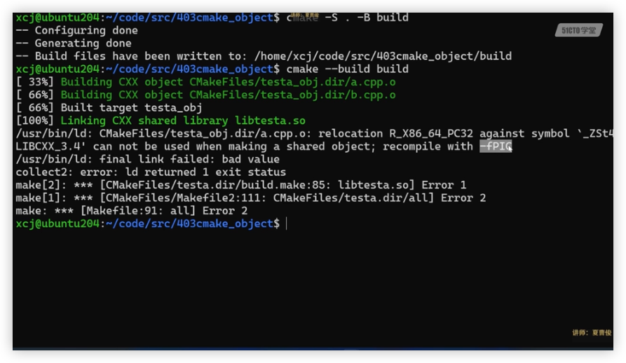

# chap4 - CMake 跨平台 C++ 编译特性设置

## 对象库的意义

就是如果我的 cmake 中，会生成多个 executable，
这多个 executable 可能会依赖同一个.cc，
这个时候，我们的这个.cc 会重复编译多次。

让我们回顾一下编译的流程：

.cc --> .i --> .S --> .o -->(link) .out

估计这个 cmake 会编译的时候清理中间文件。

这个时候，如果想要优化流程，我们可以选择生成这个.o（也就是对象库）

```cmake
add_library(
    testa_obj
    OBJECT
    a.cc b.cc
)
```

那么我们要如何使用这个对象库呢？

我们先讲：链接静态库，因为链接动态库还会有一些问题

### 链接静态库

#### 一段问题的代码

```cmake
# obj => lib
add_library(
    testa
    STATIC
    testa_obj
)
```

这段代码是有问题的，
因为我们`add_library`接受的是文件列表，而不是一个类似于变量的东西

报错信息：

```sh
CMake Error at CMakeLists.txt:53 (add_library):
  Cannot find source file:

    testa_obj


CMake Error at CMakeLists.txt:53 (add_library):
  No SOURCES given to target: testa
```

我们这个时候就需要使用 生成表达式 了

```cmake
add_library(
    testa
    STATIC
    $<TARGET_OBJECTS:testa_obj>
)
```

这个代码目前是可以正常运作了

#### 动态库

但是，如果我们要 生成动态库，会遇到报错

```cmake
add_library(
    testa
    SHARED
    $<TARGET_OBJECTS:testa_obj>
)
```

这个时候运行`cmake --build build -v`会出现链接错误：

```cmake
/Applications/Xcode.app/Contents/Developer/usr/bin/make  -f CMakeFiles/testa.dir/build.make CMakeFiles/testa.dir/depend
cd /Users/wangfiox/DOCs/cmakeLearn/notes/chap4/403cmake_object/build && /Applications/CMake.app/Contents/bin/cmake -E cmake_depends "Unix Makefiles" /Users/wangfiox/DOCs/cmakeLearn/notes/chap4/403cmake_object /Users/wangfiox/DOCs/cmakeLearn/notes/chap4/403cmake_object /Users/wangfiox/DOCs/cmakeLearn/notes/chap4/403cmake_object/build /Users/wangfiox/DOCs/cmakeLearn/notes/chap4/403cmake_object/build /Users/wangfiox/DOCs/cmakeLearn/notes/chap4/403cmake_object/build/CMakeFiles/testa.dir/DependInfo.cmake "--color="
/Applications/Xcode.app/Contents/Developer/usr/bin/make  -f CMakeFiles/testa.dir/build.make CMakeFiles/testa.dir/build
[100%] Linking CXX shared library libtesta.dylib
/Applications/CMake.app/Contents/bin/cmake -E cmake_link_script CMakeFiles/testa.dir/link.txt --verbose=1
/Applications/Xcode.app/Contents/Developer/Toolchains/XcodeDefault.xctoolchain/usr/bin/c++  -arch arm64 -isysroot /Applications/Xcode.app/Contents/Developer/Platforms/MacOSX.platform/Developer/SDKs/MacOSX14.2.sdk -dynamiclib -Wl,-headerpad_max_install_names -L/opt/homebrew/opt/llvm/lib -o libtesta.dylib -install_name @rpath/libtesta.dylib CMakeFiles/testa_obj.dir/a.cc.o CMakeFiles/testa_obj.dir/b.cc.o
duplicate symbol '__Z1Av' in:
    /Users/wangfiox/DOCs/cmakeLearn/notes/chap4/403cmake_object/build/CMakeFiles/testa_obj.dir/b.cc.o
    /Users/wangfiox/DOCs/cmakeLearn/notes/chap4/403cmake_object/build/CMakeFiles/testa_obj.dir/a.cc.o
ld: 1 duplicate symbols
clang: error: linker command failed with exit code 1 (use -v to see invocation)
```

这里因为平台问题，和老师演示的结果不太一样

下面这个截图是老师的结果：



他那里就会提示`recompile with -fPIC`。
因为，生成 shared 的时候，加入了`-fPIC`，但是在生成.obj 的时候，并没有`-fPIC`，两个地方不一致。

我们需要：在生成`.obj`的时候，加入`-fPIC`的选项

有两种 加入编译 选项的方式：

1.

```cmake
target_compile_options(testa_obj PUBLIC "-fPIC")
```

2.

```cmake
set_target_properties(testa_obj PROPERTIES POSITION_INDEPENDENT_CODE ON)
```

然而这两种方式，在我的小 mac 上行不通

#### -fPIC 的含义

`-fPIC` 是 gcc 和 clang 等编译器的一个选项，全称为 "Position Independent Code"，即位置无关代码。

当你编译一个共享库时，你通常需要使用 `-fPIC` 选项。这是因为共享库的代码需要能够被加载到任意的内存地址，而不是固定的内存地址。这就需要生成的机器代码是位置无关的，也就是说，无论它被加载到内存的哪个位置，它都能正确地执行。

如果你没有使用 `-fPIC` 选项来编译共享库，那么在加载共享库时可能会出现问题。因为没有使用 `-fPIC` 选项编译的代码可能包含一些绝对地址，这些地址在加载到不同的内存位置时可能会无效。

在你的情况中，错误信息提示你需要使用 `-fPIC` 选项来重新编译。这是因为你正在尝试将没有使用 `-fPIC` 选项编译的代码链接到一个共享库中，这可能会导致链接错误或运行时错误。
