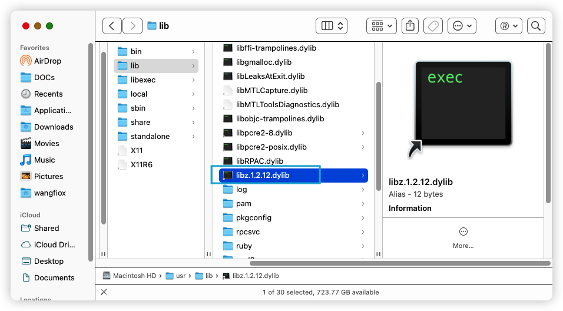

# chap4 - CMake 跨平台 C++ 编译特性设置

## cmake 构建参数

- target_include_directories 头文件路径（别的文件，可以会引用我们的库）
- target_link_libraries 导入依赖库
- target_compile_options 编译参数
- target_compile_definitions 编译传递宏
- target_compile_features c++11 c++14 c++17 c++20
- 调试属性方法

### target_include_directories

#### 基本语法

```cmake
target_include_directories(<target> [SYSTEM] [AFTER|BEFORE]
  <INTERFACE|PUBLIC|PRIVATE> [items1...]
  [<INTERFACE|PUBLIC|PRIVATE> [items2...] ...])
```

- system 告诉编译器路径是可能是系统路径，解决一些平台的警告问

因为我们的添加头文件路径，每次调用上面这个函数的时候，都是在最后追加的。
但是其实也可以头插。这就会涉及到：路径优先级的问题

- after 最后（默认）
- before 之前

#### 命令概述

- 指定目标要使用的头文件路径
- 名称`<target>`必须是由命令创建的，不能是 alias target
  - 例如`add_executable`或者是`add_library`

#### 参数流转

就是如果有项目要依赖我们这个库，依赖我的这个库，要不要用我的路径？

- INTERFACE

只有 依赖者 使用。（有可能是需要安装）

只改变： INTERFACE_INCLUDE_DIRECTORIES

- PUBLIC

依赖者 和 自己 都使用

public 改变两个的变量：

INCLUDE_DIRECTORIES 和 INTERFACE_INCLUDE_DIRECTORIES

- PRIVATE

只有自己用

只改变：INCLUDE_DIRECTORIES

#### 代码示例：

打开文件，并写入内容

```cmake
# write 写文件，清空原数据，相当于fopen
# 直接创建代码
file(WRITE a.cc [=[
void A(){}
]=])
```

添加头文件路径：

```cmake
target_include_directories(A PUBLIC "./A_PUBLIC")
```

#### 调试方式 1

通过`cmake --build build -v`，这个`-v`选项，可以看到我们的设置生效了

```sh
Run Build Command(s): /opt/homebrew/bin/ninja -v
[1/2] /usr/bin/clang++  -I/Users/wangfiox/DOCs/cmakeLearn/notes/chap4/401cmake_target_include/./A_PUBLIC -g -arch arm64 -isysroot /Applications/Xcode.app/Contents/Developer/Platforms/MacOSX.platform/Developer/SDKs/MacOSX14.2.sdk -MD -MT CMakeFiles/A.dir/a.cc.o -MF CMakeFiles/A.dir/a.cc.o.d -o CMakeFiles/A.dir/a.cc.o -c /Users/wangfiox/DOCs/cmakeLearn/notes/chap4/401cmake_target_include/a.cc
[2/2] : && /Applications/CMake.app/Contents/bin/cmake -E rm -f libA.a && /usr/bin/ar qc libA.a  CMakeFiles/A.dir/a.cc.o && /usr/bin/ranlib libA.a && /Applications/CMake.app/Contents/bin/cmake -E touch libA.a && :
```

#### 调试方式 2

除了上面的那种方式，还可以

```cmake
set(CMAKE_VERBOSE_MAKEFILE ON)  # 同样也可以看到上面那些g++语句
```

#### 调试方式 3

（回顾一下 chap1），可以先 get_property，再 message

还可以使用 cmake_print_properties 打印属性

```cmake
include(CMakePrintHelpers)
cmake_print_properties(
    TARGETS A
    PROPERTIES
    INCLUDE_DIRECTORIES
    INTERFACE_INCLUDE_DIRECTORIES
)
```

输出：

```sh
[cmake]  Properties for TARGET A:
[cmake]    A.INCLUDE_DIRECTORIES = "/Users/wangfiox/DOCs/cmakeLearn/notes/chap4/401cmake_target_include/./A_PUBLIC"
[cmake]    A.INTERFACE_INCLUDE_DIRECTORIES = "/Users/wangfiox/DOCs/cmakeLearn/notes/chap4/401cmake_target_include/./A_PUBLIC"
```

这里就是用到了两个属性：

- INCLUDE_DIRECTORIES 当前目标使用的属性
- INTERFACE_INCLUDE_DIRECTORIES 依赖当前目标 所使用的属性

所以这里我们就可以完成之前的一种想法：要不要给 依赖者 使用头文件？

### target_link_libraries

#### 基本语法

```cmake
target_link_libraries(<target>
                      <PRIVATE|PUBLIC|INTERFACE> <item>...
                     [<PRIVATE|PUBLIC|INTERFACE> <item>...]...)
```

- public

依赖者和自己都引用

- interface

只有依赖者引用

- private

只有自己引用

这里的依赖，会把很多的属性都加进来，
比方说上面的 头文件路径 属性也会加进来

#### 注意

之前有一种 "生成表达式" 中提到：`$<TARGET_OBJECTS:xlog>`，不会引入 依赖项的 头文件路径、宏等

#### 代码示例：

```cmake
# 创建 静态库
add_library(A STATIC ./a.cc)
target_include_directories(A PUBLIC "./A_PUBLIC")

add_library(B STATIC b.cc)
target_link_libraries(B PUBLIC A)
target_include_directories(B PUBLIC A) # 这样 main 也能获得 A 的属性

add_executable(main main.cc)
target_link_libraries(main PUBLIC B)
```

依赖关系：main --> B --> A

但是如果要打印属性的时候，是有问题的

#### 调试：

如果我用 cmake_print_properties

```cmake
# 打印B的属性
include(CMakePrintHelpers)
cmake_print_properties(
    TARGETS B
    PROPERTIES
    INCLUDE_DIRECTORIES
    INTERFACE_INCLUDE_DIRECTORIES
)
```

输出：

```cmake
[cmake]  Properties for TARGET A:
[cmake]    A.INCLUDE_DIRECTORIES = "/Users/wangfiox/DOCs/cmakeLearn/notes/chap4/401cmake_target_include/./A_PUBLIC"
[cmake]    A.INTERFACE_INCLUDE_DIRECTORIES = "/Users/wangfiox/DOCs/cmakeLearn/notes/chap4/401cmake_target_include/./A_PUBLIC"
[cmake] --
[cmake]  Properties for TARGET B:
[cmake]    B.INCLUDE_DIRECTORIES = "/Users/wangfiox/DOCs/cmakeLearn/notes/chap4/401cmake_target_include/A"
[cmake]    B.INTERFACE_INCLUDE_DIRECTORIES = "/Users/wangfiox/DOCs/cmakeLearn/notes/chap4/401cmake_target_include/A"
```

这里按道理来说，B 与 A 的路径应该是一摸一样的才对。
这个可能是 cmake 的缺陷：不能打印继承的属性

#### cmake 原生属性调试接口

```cmake
set(
    CMAKE_DEBUG_TARGET_PROPERTIES

)
```

然后会输出：

```sh
[cmake] CMake Debug Log at CMakeLists.txt:42 (target_link_libraries):
[cmake]   Used includes for target B:
[cmake]    * /Users/wangfiox/DOCs/cmakeLearn/notes/chap4/401cmake_target_include/./A_PUBLIC
[cmake]
[cmake] CMake Debug Log at CMakeLists.txt:64 (target_link_libraries):
[cmake]   Used includes for target main:
[cmake]    * /Users/wangfiox/DOCs/cmakeLearn/notes/chap4/401cmake_target_include/A
[cmake]    * /Users/wangfiox/DOCs/cmakeLearn/notes/chap4/401cmake_target_include/./A_PUBLIC
```

### 设定宏变量 target_compile_definitions

```cmake
target_compile_definitions(A PUBLIC A_VAR=123)
# 设定 B 库的宏：STATIC=1。B库编译时不需要; 依赖B库时需要（也就是interface0
target_compile_definitions(B INTERFACE STATIC=1)
```

### target_compile_features

#### 追加特性

```cmake
# 支持 C++17
target_compile_features(main PRIVATE cxx_std_17)
```

输出：

```sh
~/DOCs/cmakeLearn/notes/chap4/402target_compile_features (main*) » cmake --build build -v                                                                              wangfiox@wangjins-MacBook-Pro
Change Dir: '/Users/wangfiox/DOCs/cmakeLearn/notes/chap4/402target_compile_features/build'

Run Build Command(s): /opt/homebrew/bin/ninja -v
[1/2] /usr/bin/clang++   -g -std=gnu++17 -arch arm64 -isysroot /Applications/Xcode.app/Contents/Developer/Platforms/MacOSX.platform/Developer/SDKs/MacOSX14.2.sdk -MD -MT CMakeFiles/main.dir/main.cc.o -MF CMakeFiles/main.dir/main.cc.o.d -o CMakeFiles/main.dir/main.cc.o -c /Users/wangfiox/DOCs/cmakeLearn/notes/chap4/402target_compile_features/main.cc
[2/2] : && /usr/bin/clang++ -g -arch arm64 -isysroot /Applications/Xcode.app/Contents/Developer/Platforms/MacOSX.platform/Developer/SDKs/MacOSX14.2.sdk -Wl,-search_paths_first -Wl,-headerpad_max_install_names -L/opt/homebrew/opt/llvm/lib CMakeFiles/main.dir/main.cc.o -o main   && :
```

可以看到，这里是使用：`gnu++17`

#### 编译器支持的特性

```cmake
message("CMAKE_CXX_COMPILE_FEATURES = ${CMAKE_CXX_COMPILE_FEATURES}")
```

输出：

```sh
[cmake] CMAKE_CXX_COMPILE_FEATURES = cxx_std_98;cxx_template_template_parameters;cxx_std_11;cxx_alias_templates;cxx_alignas;cxx_alignof;cxx_attributes;cxx_auto_type;cxx_constexpr;cxx_decltype;cxx_decltype_incomplete_return_types;cxx_default_function_template_args;cxx_defaulted_functions;cxx_defaulted_move_initializers;cxx_delegating_constructors;cxx_deleted_functions;cxx_enum_forward_declarations;cxx_explicit_conversions;cxx_extended_friend_declarations;cxx_extern_templates;cxx_final;cxx_func_identifier;cxx_generalized_initializers;cxx_inheriting_constructors;cxx_inline_namespaces;cxx_lambdas;cxx_local_type_template_args;cxx_long_long_type;cxx_noexcept;cxx_nonstatic_member_init;cxx_nullptr;cxx_override;cxx_range_for;cxx_raw_string_literals;cxx_reference_qualified_functions;cxx_right_angle_brackets;cxx_rvalue_references;cxx_sizeof_member;cxx_static_assert;cxx_strong_enums;cxx_thread_local;cxx_trailing_return_types;cxx_unicode_literals;cxx_uniform_initialization;cxx_unrestricted_unions;cxx_user_literals;cxx_variadic_macros;cxx_variadic_templates;cxx_std_14;cxx_aggregate_default_initializers;cxx_attribute_deprecated;cxx_binary_literals;cxx_contextual_conversions;cxx_decltype_auto;cxx_digit_separators;cxx_generic_lambdas;cxx_lambda_init_captures;cxx_relaxed_constexpr;cxx_return_type_deduction;cxx_variable_templates;cxx_std_17;cxx_std_20;cxx_std_23
```

## add_library 详细配置

### 二进制对象库 OBJECT 的编译 和 依赖配置

#### 分 obj 编译

- obj 用于两个执行文件，用于测试

- add_library(archive OBJECT archive.cpp zip.cpp lzma.cpp)

#### -fPIC

- set(CMAKE_POSITION_INDEPENDENT_CODE ON)

- set_target_properties(lib1 PROPERTIES POSITION_INDEPENDENT_CODE ON)

### 带版本号的库符号链接

就是我们会发现，很多库都会有一个版本号。
然后这个版本号。而且甚至有符号链接（symbolic link，软链接）



像上面的`libz.dylib`就是

一般有两种版本：一种是可执行文件版本 version，还有一种是动态库的版本 soversion。
静态库并不需要版本号，因为静态库早就与.out 融合了。

相当于一个程序是分两次分发的，一个是.so 的分发，一个是.out 的分发。
有时候.out 不用更改，但是.so 需要更改

```cmake
add_library(a SHARED ./a.cc)

set_target_properties(
    a
    PROPERTIES
    VERSION "2.0.1"
    SOVERSION "15"
    NO_SONAME OFF # OFF生成符号链接，ON不生成符号链接
)

#[[ 依赖顺序：liba.dylib --> liba.15.dylib --> liba.2.0.1.dylib
lrwxr-xr-x  1 wangfiox  staff    16B Jan  5 19:24 liba.15.dylib -> liba.2.0.1.dylib
-rwxr-xr-x  1 wangfiox  staff    17K Jan  5 19:24 liba.2.0.1.dylib
lrwxr-xr-x  1 wangfiox  staff    13B Jan  5 19:24 liba.dylib -> liba.15.dylib
]]
```

（当然，windows 的 动态库 还是要注意 export 的）

## cmake debug release 配置

debug，release 还是有许多不同的，比方说：优化选项，输出路径。
学会配置！

有几种不同的优化：

- `-O`或者`-O1`
- `-O2`
- `-O3`

config 对应的优化：

- `-g` Debug：加入调试信息（可以看到 二进制，反汇编，源码之间的映射关系）
- `-O` release
- `-O2 -g` RelWithDebInfo
- `-O3` MinSizeRel （O3 优化，减少了 .out 的大小）

### linux 配置

两种指定（优化选项）的方式：

1.

配置时指定：

```cmake
set(CMAKE_BUILD_TYPE Debug)
```

2.

生成 makefile 阶段传入参数

```sh
cmake .. -D CMAKE_BUILD_TYPE=MinSizeRel
```

### 配置 DEBUG RELEASE 不同输出路径

这里的`<CONFIG>`有两个选择：DEBUG、RELEASE

- `RUNTIME_OUTPUT_DIRECTORY_<CONFIG>` .out 和 dll 输出
- `ARCHIVE_OUTPUT_DIRECTORY_<CONFIG>` lib 和 .a 库（静态库）输出
- `LIBRARY_OUTPUT_DIRECTORY_<CONFIG>` .so 动态库输出
- `PDB_OUTPUT_DIRECTORY_<CONFIG>` pdb 文件输出（windows 特有，用来放调试信息）

### 示例

```cmake
# 静态库
# src/
# ----- slib.cc
# ----- dlib.cc
# ----- main.cc
# bin/
# ----- debug
# --------- main
# --------- dlib.dll [windows]
# ----- release
# --------- ...
# lib/
# ----- debug
# --------- slib.lib [windows]
# --------- dlib.lib [windows]
# --------- dlib.so
# --------- dlib.a
# ----- release
# --------- ...
```

windows 下，动态库会生成两个文件：.dll、.lib

#### mac 的 CMAKE_BUILD_TYPE 默认是 DEBUG

```cmake
# mac默认是debug --> -g
message("CMAKE_BUILD_TYPE = ${CMAKE_BUILD_TYPE}")
```

两种控制方式：

1. `set(CMAKE_BUILD_TYPE Debug)`
2. `cmake -S . -B build -D CMAKE_BUILD_TYPE=Debug`

当然，如果是要用户选择 版本 的话，可以设置 BOOL 的 cache 变量，或者是 option

#### windows 配置

```sh
cmake -S . -D win
```

windows 会直接创建一个 Debug 目录，也就是会：`./win/Debug/slib.lib`

而且 windows 会直接一次就生成 4 分 debug、release、minsizerel、RelWithDebInfo

windows 生成阶段无法配置，只能在 构建（--build） 阶段配置

```sh
cmake --build win --config Release
```

### 配置输出路径

```cmake
# 输出路径
set(OUT_LIB_PATH ${CMAKE_SOURCE_DIR}/lib)
set_target_properties(slib PROPERTIES
    ARCHIVE_OUTPUT_DIRECTORY ${OUT_LIB_PATH} # 静态库和lib文件的输出
    ARCHIVE_OUTPUT_DIRECTORY_DEBUG ${OUT_LIB_PATH}/debug
    ARCHIVE_OUTPUT_DIRECTORY_RELEASE ${OUT_LIB_PATH}/release
)
```
