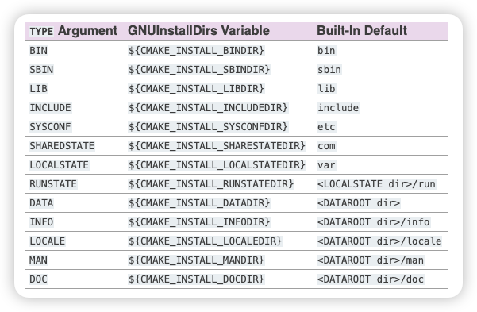

# cmake install 部署项目

- 测试代码准备
- 安装目标
- 安装文件
- 安装目录
- 安装时执行程序
- 安装指定的模块
- 自定义 find_package 可导入库

## 安装时执行程序

```cmake
# ###### 安装目标 ########

# 安装目标 desination 指定 相对 cmake_install_prefix 的输出路径
# cmake_install_prefix默认是/usr/local
# windows的默认cmake_install_prefix是 C:/Program Files (x86)/
# 可以在生成的时候 cmake -S . -B build -DCMAKE_INSTALL_PREFIX=<path>
install(TARGETS slib dlib ${PROJECT_NAME} DESTINATION bin)

# cmake --install build（这个和build平行的）
```

当然这个`cmake -D`也可以是

```cmake
set(CMAKE_INSTALL_PREFIX ./out)
```

windows 中，还可以指定安装版本`cmake --install build Debug`

### 分配不同的路径

上面我们是将所有的.a、.lib、.out 之类的，都安装到了一个路径。

但是，我们的`/usr/local`里面，也有`/usr/local/bin`也有`/usr/local/lib`，这个肯定是要再细分的

## 安装目标（有 5 种目标）

- runtime

由 add_executable 创建，
包含：windows 动态连接库 dll 文件、可执行文件。放到 bin

```cmake

```

- archive （归档）

windows 动态库到处符号 .lib .dll

静态库

- library

动态库

- public_header、private_header

```cmake
# ###### 安装目标 ########
set(CMAKE_INSTALL_PREFIX ./out)

# cmake --install build（这个和build平行的）
install(TARGETS ${PROJECT_NAME}
    RUNTIME DESTINATION bin # 执行程序
)

# 设置头文件属性
set_target_properties(slib PROPERTIES PUBLIC_HEADER include/slib.h)
set_target_properties(slib PROPERTIES PRIVATE_HEADER include/slib_pri.h)

install(TARGETS slib dlib
    RUNTIME DESTINATION bin # 执行程序和dll文件输出
    ARCHIVE DESTINATION lib # 静态库和windows动态库导出符号.lib
    LIBRARY DESTINATION lib # linux和mac的动态库.so 和 .lib导出到lib种
    PRIVATE_HEADER DESTINATION include
    PUBLIC_HEADER DESTINATION inc
)
```

## debug release 不同输出路径

```cmake
install(TARGETS slib dlib
    CONFIGURATIONS Debug # <-- 改了这里
    RUNTIME DESTINATION debug/bin # 执行程序和dll文件输出
    ARCHIVE DESTINATION debug/lib # 静态库和windows动态库导出符号.lib
    LIBRARY DESTINATION debug/lib # linux和mac的动态库.so 和 .lib导出到lib种
    PRIVATE_HEADER DESTINATION debug/include
    PUBLIC_HEADER DESTINATION debug/inc
)
```

要先 生成 debug 版 `cmake -S . -B build -DCMAKE_BUILD_TYPE=Debug `的 makefile

再安装 debug 版

```cmake
cmake --build build
cmake --install build --config Debug
```

编译并生成 Debug 版本

## cmake install 安装文件

上面的 install 是 TARGETS 的，下面是 FILES

```cmake
install(<FILES|PROGRAMS> <file>...
        TYPE <type> | DESTINATION <dir>
        [PERMISSIONS <permission>...]
        [CONFIGURATIONS <config>...]
        [COMPONENT <component>]
        [RENAME <name>] [OPTIONAL] [EXCLUDE_FROM_ALL])
```

有两种安装到路径的方式：

1. 指定类型 TYPE
2. 指定目录 DESTINATION

### 文件安装到指定目录

```cmake
# 文件安装到指定目录
install(FILES a.h b.h
    DESTINATION include
)
```

### 目标可选 optional 目标不存在不出错

```cmake
install(FILES c.h
    DESTINATION inc OPTIONAL
)
```

### 文件类型 TYPE

文件类型就这么多



```cmake
include(GNUInstallDirs)
message("CMAKE_INSTALL_DATAROOTDIR = ${CMAKE_INSTALL_DATAROOTDIR}") # 默认是share
install(FILES a.h TYPE DOC) # <DATAROOT dir>/doc
install(FILES b.h TYPE LIB) # /lib
```

要`include(GNUInstallDirs)`才能看到`CMAKE_INSTALL_DATAROOTDIR`

否则`message`输出：

```sh
[cmake] CMAKE_INSTALL_DATAROOTDIR =
```

### 文件权限

既然有了文件，对应的肯定有文件的权限

默认权限是：owner_read owner_write group_read world_read，也就是 644

```cmake
install(FILES a.h
    DESTINATION pub
    PERMISSIONS OWNER_READ OWNER_WRITE GROUP_READ
)
```

可以看到：

```sh
~/DOCs/cpp/cmakeLearn/notes/chap5/502cmake_install_file/out/pub (main*) » ls -l
total 0
-rw-r-----  1 wangfiox  staff     0B Jan  6 14:49 a.h
```

注意一下：
有的操作系统，权限可能不一样。
windows 只有两种权限：隐藏权限 和 只读权限。
因为 windows 的可执行权限是用：后缀名 控制的

### cmake install 目录

安装整一个目录：懒得一个一个控制了

```cmake
set(CMAKE_INSTALL_PREFIX out)

file(WRITE doc/index.html "")
file(WRITE doc/doc.html "")
file(WRITE doc/doc.cc "")
file(WRITE doc/doc.c "")

install(DIRECTORY doc TYPE DOC)
```

注意：小心目录无限递归

#### 匹配

```cmake
# 过滤，只复制 *.html 文件
install(DIRECTORY doc DESTINATION html_doc
    FILES_MATCHING PATTERN "*.html"
)
```

#### 忽略版本控制

```cmake
# 排除
install(DIRECTORY doc DESTINATION no_c
    PATTERN "*.c" EXCLUDE
)
```

#### 既想要匹配 又想要忽略

```cmake
install(DIRECTORY doc DESTINATION and
    FILES_MATCHING
    PATTERN "*.cc"
    PATTERN ".git" EXCLUDE
)
```

## 安装时执行程序

我们希望在安装的时候，执行一些东西

这部分代码会在`cmake --install`的时候使用

```cmake
set(CMAKE_INSTALL_PREFIX out)

file(WRITE a.h "")
file(WRITE b.h "")
install(CODE "message(\"begin install\")")

install(FILES a.h TYPE INCLUDE)
install(CODE "message(\"a.h install success!\")")
install(FILES b.h TYPE INCLUDE)
install(CODE "message(\"b.h install success!\")")
```

输出：

```sh
~/DOCs/cpp/cmakeLearn/notes/chap5/504code (main*) » cmake --install build
-- Install configuration: "Debug"
begin install
-- Installing: /Users/wangfiox/DOCs/cpp/cmakeLearn/notes/chap5/504code/out/include/a.h
a.h install success!
-- Installing: /Users/wangfiox/DOCs/cpp/cmakeLearn/notes/chap5/504code/out/include/b.h
b.h install success!
```

### 写入安装时间

```cmake
install(CODE [=[
    string(TIMESTAMP now "%Y-%m-%d %H:%M:%S")
    message(${now})
    FILE(APPEND install_log.txt "${now}\n")
]=])
```

## 安装指定的模块

是一种通用的约定

用到`COMPONENT`（主键）

### ./CMakeLists.txt

```cmake
set(CMAKE_INSTALL_PREFIX out)

file(WRITE "a.cc" "")
file(WRITE "doc.html" "")

install(FILES a.cc
    DESTINATION src
    COMPONENT src # 定义我们自己的 主键 名称
)

install(FILES doc.html
    DESTINATION doc
    COMPONENT doc
)
```

然后我们`cmake -S . -B build`，可以看到 build 目录下有`cmake_install.cmake`

接着我们就可以通过主键安装了

```sh
cd build && cmake -DCOMPONENT=doc -P cmake_install.cmake
```

## 自定义 find_package 可导入库

这个用的很多

两种想法：

1. 给我们的库支持 find_package
2. 使用别人的库

使用的逻辑（流程）：

1. 先`find_package(slib)`调用
2. `<PackageName>_FOUND`看看有没有找个这个库
3. 怎么去找？有两种方式（先会找 module mode，在会找 config mode）
   1. module mode：会到 cmake_module_path 路径下面，里面有很多 Find<PackageName>.cmake（如果我们要给我们的库支持 find_package，那么就要手写这个.cmake）
   2. config mode：

### config mode

查找路径：cmake_prefix_path

读取文件：

- config

里面包含了配置参数，这个库的路径，头文件路径等

约定名字的格式：

`<lowercasePackageName>-config.cmake`

`<PackageName>Config.cmake`

- version

`<lowercasePackageName>-config-version`

`<PackageName>ConfigVersion.cmake`

生成 config mode 文件：

- config

```cmake
install(TARGETS slib
    EXPORT slib
    RUNTIME DESTINATION bin
    LIBRARY DESTINATION ${CMAKE_SOURCE_DIR} lib
    PUBLIC_HEADER DESTINATION include
)
```

```cmake
install(EXPORT slib
    NAMESPACE xcpp::  # 这个是可选项，为了防止库名冲突
    FILE slibConfig.cmake
    DESTINATION mod/slib/
)
```

- version

### 导出 package

这个导出 package，我只能说感觉很坑，详情请看 506 代码

#### 制作库

```cmake
set(CMAKE_INSTALL_PREFIX "/Users/wangfiox/DOCs/cpp/cmakeLearn/notes/chap5/slib")
file(WRITE include/slib.h "void SLib();")
file(WRITE slib.cc " #include xxxx  void SLib() {}")
add_library(slib STATIC slib.cc)
set_target_properties(slib PROPERTIES PUBLIC_HEADER include/slib.h)
target_include_directories(slib PUBLIC
    $<BUILD_INTERFACE:${CMAKE_CURRENT_SOURCE_DIR}/include>
    $<INSTALL_INTERFACE:include>
)
```

这里利用了：生成表达式

因为 编译库 和 安装库 的路径是不一样的。他的头文件路径也是会发生改变，因此需要生成表达式控制

#### 导出库 （install）

```cmake
install(TARGETS slib
    EXPORT slib # 要标注导出
    RUNTIME DESTINATION bin
    LIBRARY DESTINATION lib
    ARCHIVE DESTINATION lib
    PUBLIC_HEADER DESTINATION include # 记得导出头文件路径
)

install(EXPORT slib
    FILE slibConfig.cmake
    DESTINATION config
)
```

### find_package

```cmake
list(APPEND CMAKE_PREFIX_PATH "/Users/wangfiox/DOCs/cpp/cmakeLearn/notes/chap5/slib")

find_package(slib)
message("slib_FOUND = ${slib_FOUND}")

add_executable(${PROJECT_NAME} main.cc)
target_link_libraries(${PROJECT_NAME} slib)
target_include_directories(${PROJECT_NAME} PRIVATE ${slib_INCLUDE_DIRS})
message("slib_INCLUDE_DIRS = ${slib_INCLUDE_DIRS}")
```

这个在我的电脑上并没有成功，我根据报错提示，使用了这个才成功的：

```sh
# 报错
  Could not find a package configuration file provided by "slib" with any of
  the following names:

    slibConfig.cmake
    slib-config.cmake

  Add the installation prefix of "slib" to CMAKE_PREFIX_PATH or set
  "slib_DIR" to a directory containing one of the above files.  If "slib"
  provides a separate development package or SDK, be sure it has been
  installed.
```

我手动指定了`slib_DIR`才行的。

find_package 以后，不要忘了链接`target_link_libraries`

## 多版本自定义 package 共存

```cmake
# 配置version（替换文件中的version）
configure_file("slib.cc.in" "${CMAKE_SOURCE_DIR}/slib.cc")
```

如果我们传入`cmake -S . -B build -Dversion=1.1`

然后在`cmake --install build`的时候可以看到：

```sh
~/DOCs/cpp/cmakeLearn/notes/chap5/508version (main*) » cmake --install build
-- Install configuration: "Debug"
-- Installing: /Users/wangfiox/DOCs/cpp/cmakeLearn/notes/chap5/slib-1.1/lib/libslib.a
-- Installing: /Users/wangfiox/DOCs/cpp/cmakeLearn/notes/chap5/slib-1.1/include/slib.h
-- Installing: /Users/wangfiox/DOCs/cpp/cmakeLearn/notes/chap5/slib-1.1/config/slibConfig.cmake
-- Installing: /Users/wangfiox/DOCs/cpp/cmakeLearn/notes/chap5/slib-1.1/config/slibConfig-debug.cmake
```

### 如何多版本共存？

可以通过给路径明明解决：`slib-${version}`，这样就允许多版本的存在了

那么还有问题，就是我 find_package 会不会找到相应的版本呢？

```cmake
find_package(slib ${version})
```

### 导出版本号信息

```cmake
install(
    EXPORT slib
    FILE slibConfig.cmake DESTINATION config/slib-${version}/
)

# 写入版本号信息
include(CMakePackageConfigHelpers)
write_basic_package_version_file(
    ${CMAKE_INSTALL_PREFIX}/config/slib-${version}/sliConfigVersion.cmake
    VERSION ${version}
    COMPATIBILITY SameMajorVersion # 版本兼容问题：大版本是兼容的
)
```
